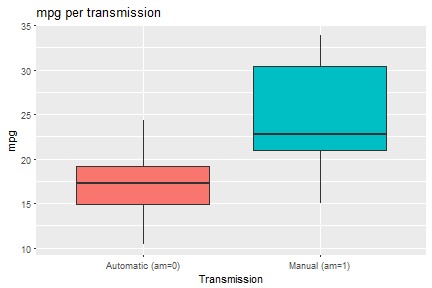
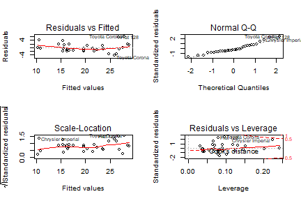
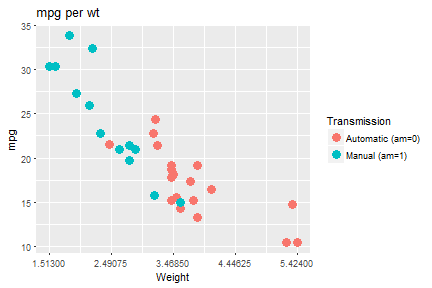

---
output:
  html_document: default
  pdf_document: default
---
# Course project


## Executive Summary

In this course project, we should use the mtcars database to answer if the automatic or manual transmission is better for mpg and to quantify the mpg difference between automatic and manual transmissions.

A simple look of the relation between mpg and the transmission might show that the manual transmission is better for mpg than the automatic transmission. But when we consider the other variables, we observe that most of mpg variation is explained by only two variables: wt (weight) and cyl (number of cylinders). The apparent fact that manual transmission is better for mpg than automatic is due to the weight data, which is higher for the cars with automatic transmission than those with manual transmission.

Therefore, it is not possible to fairly quantify the mpg difference between automatic and manual when we consider the relation among all the variables. But, considering a situation where we only have access to the mpg and transmission data, our best guess in this case, considering the mtcars data, is that we can expect a 5.5 increase of the mpg when using a manual car than an automatic.

## Report

According to the help file of the mtcars database, it has 32 observations on 11 variables: mpg (Miles/(US) gallon), cyl (Number of cylinders), disp (Displacement), hp (Gross horsepower), drat (Rear axle ratio), wt (Weight (1000 lbs)), qsec (1/4 mile time), vs (V/S), am (Transmission, 0 for automatic and 1 for manual), gear (Number of forward gears), and carb (Number of carburetors).

First, let's do some exploratory analysis and check a simple box plot of the transmission versus mpg (Figure 1 of the appendix). The median of the manual transmission is higher than the automatic. Also, there are observations at higher mpg only for manual transmissions (and for lower mgp only for automatic transmissions). So, it seems that the manual transmission is more efficient than the automatic transmission. The median mpg value for automatic transmission is 17.3 and for manual transmission is 22.8. So, the difference is **5.5** mpg.

**But this can be misleading. It is necessary to check the relation between the variables.** The correlation of each variable with mpg is (printed from the higher to the lower correlation):


```r
correlation_with_mpg <- cor(mtcars)[,1]
correlation_with_mpg[order(abs(correlation_with_mpg), decreasing=T)]
```

```
##        mpg         wt        cyl       disp         hp       drat 
##  1.0000000 -0.8676594 -0.8521620 -0.8475514 -0.7761684  0.6811719 
##         vs         am       carb       gear       qsec 
##  0.6640389  0.5998324 -0.5509251  0.4802848  0.4186840
```

The most relevant variable is wt, followed by cyl, disp, hp, drat, vs, am, carb, gear, and qsec. All variables have more than 40% of correlation with mpg. First, we will consider a linear model with all variables. Then, we will remove one variable at a time considering the correlation order:


```r
fit1 <- lm(mpg~., data=mtcars)
fit2 <- lm(mpg~wt+cyl+disp+hp+drat+vs+am+carb+gear+qsec, data=mtcars)
fit3 <- lm(mpg~wt+cyl+disp+hp+drat+vs+am+carb+gear, data=mtcars)
fit4 <- lm(mpg~wt+cyl+disp+hp+drat+vs+am+carb, data=mtcars)
fit5 <- lm(mpg~wt+cyl+disp+hp+drat+vs+am, data=mtcars)
fit6 <- lm(mpg~wt+cyl+disp+hp+drat+vs, data=mtcars)
fit7 <- lm(mpg~wt+cyl+disp+hp+drat, data=mtcars)
fit8 <- lm(mpg~wt+cyl+disp+hp, data=mtcars)
fit9 <- lm(mpg~wt+cyl+disp, data=mtcars)
fit10 <- lm(mpg~wt+cyl, data=mtcars)
fit11 <- lm(mpg~wt, data=mtcars)
```

With all these models, let's check the **R squared** of each of them:


```r
c(summary(fit1)$r.squared, summary(fit2)$r.squared, summary(fit3)$r.squared, summary(fit4)$r.squared, summary(fit5)$r.squared, summary(fit6)$r.squared, summary(fit7)$r.squared, summary(fit8)$r.squared, summary(fit9)$r.squared, summary(fit10)$r.squared, summary(fit11)$r.squared)
```

```
##  [1] 0.8690158 0.8690158 0.8611439 0.8603837 0.8591051 0.8518561 0.8513152
##  [8] 0.8486348 0.8326070 0.8302274 0.7528328
```

We start with a R square of 0.869 (with all variables) and reach 0.753 (considering only the varible wt).When we consider the variables wt and cyl, the R square is 0.83. Including more variables will increase at most 3p.p. of the R square value. For this reason, I consider that the model (mpg ~ wt + cyl) explains most part of the mpg variation. Figure 2 of the appendix shows the residual plot.

To check the influence of am, let's compare the R square of the fit10 (mpg ~ wt + cyl) and a new model with this variable (mpg ~ wt + cyl + am):


```r
fit_new <- lm(mpg ~ wt + cyl + am, data = mtcars)
r_square_incresed <- summary(fit_new)$r.squared - summary(fit10)$r.squared
```

Including the variable am only increases the R square value in 1.1092403 &times; 10<sup>-4</sup>. Therefore, it is not relevant for the model. But why the boxplot in the beginning of this report shows that the manual transmission is better than the automatic for mpg? Figure 3 of the appendix answers this question. It represents the plot of mpg versus wt with a clear relation between them. Besides this, the heavier cars has automatic transmission (and the lighter, manual transmission). So, the aparent relation between mgp and transmission can be explained by the weight variable (for manual transmission it varies from 1.513 to 3.57, and for automatic transmission, from 2.465 to 5.424). 

A possible explanation for this is that perhaps the mtcars database contains more types of cars (e.g. sport cars or utility cars) for some transmission. But since I am not a car expert, this requires further investigation.

## Conclusions

Most of mpg variation can be explained by the weight and the number of cylinders of the car. The apparent fact that manual transmission is better for mpg than automatic is due to the weight data in the observations of the mtcars database (in this database, heavier cars tends to a automatic transmission, and lighter cars tends to a manual transmission).

Therefore, it is not possible to fairly quantify the mpg difference between automatic and manual when we consider the relation among all the variables. But, considering a situation where we only have access to the mpg and transmission data, our best guess in this case, considering the mtcars data, is that we can expect a 5.5 increase of the mpg when using a manual car than an automatic.

## Appendix - Figures

Figure 1: Boxplot of mpg versus transmission.

```r
library(ggplot2)
plot <- ggplot(mtcars, aes(x=factor(am), y=mpg, fill=factor(am)))
plot + geom_boxplot(notch=F) + 
    scale_x_discrete(labels = c('Automatic (am=0)', 'Manual (am=1)')) + 
    scale_fill_discrete(guide=FALSE) +
    xlab('Transmission') + 
    ylab('mpg') +
    ggtitle("mpg per transmission")
```



Figure 2: Residual plot.

```r
par(mfrow=c(2,2))    
plot(fit10)
```



Figure 3: Scatter plot of mpg versus weight showing the influence of transmission.

```r
breaks <- seq(min(mtcars$wt), max(mtcars$wt), by = (max(mtcars$wt) - min(mtcars$wt))/4)
plot <- ggplot(mtcars, aes(x=wt, y=mpg, color=factor(am)))
plot + geom_point(aes(color=factor(am)), size=4) + 
    scale_x_continuous(breaks = breaks) +
    xlab('Weight') + 
    ylab('mpg') +
    labs(color="Transmission")+
    scale_color_manual(labels = c('Automatic (am=0)', 'Manual (am=1)'), values=c('#F8766D', '#00BFC4')) +
    ggtitle("mpg per wt")
```


