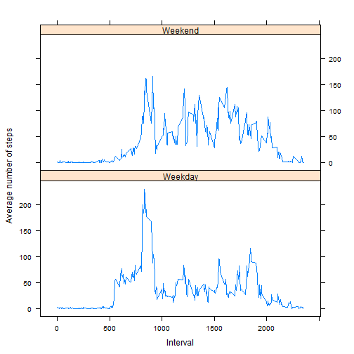

# Program assignment 1
*Leandro Carísio Fernandes*


In this assignment we will work with the *Activity monitoring data* dataset. This dataset is available as a zip file [here](https://d396qusza40orc.cloudfront.net/repdata%2Fdata%2Factivity.zip). The zip file contains one file, *activity.csv*. This file has 17,568 observations of a personal activity monitoring device and each observation has information about three variables:

* steps: Number of steps taking in a 5-minute interval (missing values are coded as NA)
* date: The date on which the measurement was taken in YYYY-MM-DD format
* interval: Identifier for the 5-minute interval in which measurement was taken

## 1. First part - Loading and preprocessing the data

In the first part of the assignment, we need to load and preprocess the data. To read the file, first we can download it to the current workspace and unzip it:


```r
# Uncomment this lines to download the zip file and unzip it
# fileUrl <- "https://d396qusza40orc.cloudfront.net/repdata%2Fdata%2Factivity.zip"
# download.file(fileUrl, destfile = "./data.zip", method="curl")
# unzip(zipfile = "./data.zip", exdir = ".")

original_data <- read.csv("activity.csv")
```

Note that the variable `original_data` contains the raw data of the *activity.csv* file.

After reading the data, we can observe that it has 3 columns (their names are **steps, date, interval**).

If we check the type of each column:


```r
str(original_data)
```

```
## 'data.frame':	17568 obs. of  3 variables:
##  $ steps   : int  NA NA NA NA NA NA NA NA NA NA ...
##  $ date    : Factor w/ 61 levels "2012-10-01","2012-10-02",..: 1 1 1 1 1 1 1 1 1 1 ...
##  $ interval: int  0 5 10 15 20 25 30 35 40 45 ...
```

So, the steps and interval columns has type *int*. Note that the date column contains *Factor*, and not Date! So, let's convert it to Date:


```r
original_data$date <- as.Date(original_data$date, format = "%Y-%m-%d")
str(original_data)
```

```
## 'data.frame':	17568 obs. of  3 variables:
##  $ steps   : int  NA NA NA NA NA NA NA NA NA NA ...
##  $ date    : Date, format: "2012-10-01" "2012-10-01" ...
##  $ interval: int  0 5 10 15 20 25 30 35 40 45 ...
```

Other important issue is that we can see some **NA** in the steps column. It is interesting to check the number of **NA** in each column:


```r
sum(is.na(original_data$steps))
```

```
## [1] 2304
```

```r
sum(is.na(original_data$date))
```

```
## [1] 0
```

```r
sum(is.na(original_data$interval))
```

```
## [1] 0
```

There are some **NA** in the first column (steps). This is important, because we should deal with it during this assignment.

At this point, the `original_data` variable is pre-processed. We only changed the type of the column date from **Factor** to **Date**.

## 2. Second part - What is the total number of steps taken per day?

For this part of the assignment, we are suppose to ignore the missing values in the dataset. So, we will create a second variable, `data_ig_na` with the observations of `original_data` that does not contain **NA** values:


```r
valid <- !(is.na(original_data$steps))
data_ig_na <- original_data[valid, ]
```

### 2.1 Calculate the total number of steps taken per day

Now we should calculate the total number of steps taken per day. To do this, we can use `tapply` to sum all the steps of a given day and store the result in the variable `steps_per_day`. Then, we generate a table with this information:


```r
steps_per_day <- tapply(data_ig_na$steps, data_ig_na$date, sum)
table <- cbind(names(steps_per_day), unname(steps_per_day))
colnames(table) <- c("Date", "Steps in this day")
kable(table)
```


|Date       |Steps in this day |
|:----------|:-----------------|
|2012-10-02 |126               |
|2012-10-03 |11352             |
|2012-10-04 |12116             |
|2012-10-05 |13294             |
|2012-10-06 |15420             |
|2012-10-07 |11015             |
|2012-10-09 |12811             |
|2012-10-10 |9900              |
|2012-10-11 |10304             |
|2012-10-12 |17382             |
|2012-10-13 |12426             |
|2012-10-14 |15098             |
|2012-10-15 |10139             |
|2012-10-16 |15084             |
|2012-10-17 |13452             |
|2012-10-18 |10056             |
|2012-10-19 |11829             |
|2012-10-20 |10395             |
|2012-10-21 |8821              |
|2012-10-22 |13460             |
|2012-10-23 |8918              |
|2012-10-24 |8355              |
|2012-10-25 |2492              |
|2012-10-26 |6778              |
|2012-10-27 |10119             |
|2012-10-28 |11458             |
|2012-10-29 |5018              |
|2012-10-30 |9819              |
|2012-10-31 |15414             |
|2012-11-02 |10600             |
|2012-11-03 |10571             |
|2012-11-05 |10439             |
|2012-11-06 |8334              |
|2012-11-07 |12883             |
|2012-11-08 |3219              |
|2012-11-11 |12608             |
|2012-11-12 |10765             |
|2012-11-13 |7336              |
|2012-11-15 |41                |
|2012-11-16 |5441              |
|2012-11-17 |14339             |
|2012-11-18 |15110             |
|2012-11-19 |8841              |
|2012-11-20 |4472              |
|2012-11-21 |12787             |
|2012-11-22 |20427             |
|2012-11-23 |21194             |
|2012-11-24 |14478             |
|2012-11-25 |11834             |
|2012-11-26 |11162             |
|2012-11-27 |13646             |
|2012-11-28 |10183             |
|2012-11-29 |7047              |

### 2.2 Histogram of the number of steps taken per day

We can use the information of the previous table to build a histogram of the number of steps taken per day. The histogram will show the number of days with a given number of steps taken per day (actually, it is an interval):


```r
hist(steps_per_day, 
        xlab="Number of steps per day",
        ylim = c(0, 35),
        breaks = 5,
        main = "Histogram",
        col="orange")
```


### 2.3 Calculate and report the mean and median of the total number of steps taken per day

To calculate the mean and median of the total number of steps taken per day, we can use the `mean` and `median` functions:


```r
mean(steps_per_day)
```

```
## [1] 10766.19
```

```r
median(steps_per_day)
```

```
## [1] 10765
```

So, the mean is 10766.19 and the median is 10765.

## 3. What is the average daily activity pattern?

### 3.1 Make a time series plot (i.e. type = "l") of the 5-minute interval (x-axis) and the average number of steps taken, averaged across all days (y-axis)

Again, we can use the tapply function to solve this problem. All we need to do is apply the function `mean` over the `data_ig_na$steps$` (separeted by `data_ig_na$interval`):


```r
avg_steps_per_interval <- tapply(data_ig_na$steps, data_ig_na$interval, mean)
plot(x = names(avg_steps_per_interval), y = avg_steps_per_interval, 
        type = "l",
        xlab = "Interval",
        ylab = "Steps in the interval")
```


### 3.2 Which 5-minute interval, on average across all the days in the dataset, contains the maximum number of steps?

We can use the `which.max(avg_steps_per_interval)` function to find the index of the avg_steps_per_interval:


```r
interval_idx <- which.max(avg_steps_per_interval)
interval <- names(interval_idx)
idx <- unname(interval_idx)
num_steps <- avg_steps_per_interval[idx]
print(sprintf("Interval: %s", interval))
```

```
## [1] "Interval: 835"
```

```r
print(sprintf("Index: %d", idx))
```

```
## [1] "Index: 104"
```

```r
print(sprintf("Number of steps: %.2f", num_steps))
```

```
## [1] "Number of steps: 206.17"
```

So, the maximum number of steps is 206.1698113, which occurs at the index 104, which refers to the interval 835.

## 4. Inputing missing values

In this part of the assignment, we are should check the effect of the missing values in the final result. Until this section, we ignore the missing values. Now we need some strategy to deal with them.

### 4.1 Calculate and report the total number of missing values in the dataset (i.e. the total number of rows with NAs)

As previously shown, the number of **NAs** is:


```r
sum(is.na(original_data$steps))
```

```
## [1] 2304
```

### 4.2 Devise a strategy for filling in all of the missing values in the dataset. The strategy does not need to be sophisticated. For example, you could use the mean/median for that day, or the mean for that 5-minute interval, etc.

I will use the mean for the 5-minute interval for fill all the missing values.

So, first let's copy the `original_data` to a new variable (`data`) and work with it. Then, next step is check the **NAs** rows.

To deal with the **NAs**, I will group the data by interval using the `dplyr` library. Then, we can summarise it by mean, removing the **NAs**.

The last step is to iterate over the dataset and, for each observation equals to **NA**, replace it by the mean calculated with `dplyr` library:


```r
data <- original_data
na_rows <- is.na(data$steps)

library(dplyr)
df <- data.frame(data)
df_grouped_by_interval <- group_by(df, interval) %>% summarise(mean(steps, na.rm = T))
colnames(df_grouped_by_interval) <- c("interval", "steps_per_interval")
```

```
## Error in names(x) <- value: 'names' attribute [2] must be the same length as the vector [1]
```

```r
for (idx in 1:nrow(data)) {
    if (na_rows[idx]) {
        # data[idx, 1] is NA. Get the value of the interval (data[idx, 3])
        interval <- data[idx, 3]
        # get the index in df_grouped_by_interval with interval == data[idx, 3]
        idx_interval <- which(df_grouped_by_interval$interval == data[idx, 3])
        # replace the NA by the mean
        data[idx, 1] <- df_grouped_by_interval$steps_per_interval[idx_interval]
    }
}
```

```
## Error in x[[jj]][iseq] <- vjj: replacement has length zero
```

### 4.3 Create a new dataset that is equal to the original dataset but with the missing data filled in.

The new dataset was created in the previous step and is represented by the variable `data`.

### 4.4 Make a histogram of the total number of steps taken each day and Calculate and report the mean and median total number of steps taken per day. Do these values differ from the estimates from the first part of the assignment? What is the impact of imputing missing data on the estimates of the total daily number of steps?

The code to build the histogram and the mean and median number of steps per day is the same as in previous sections:


```r
steps_per_day <- tapply(data$steps, data$date, sum)

hist(steps_per_day, 
        xlab="Number of steps per day",
        ylim = c(0, 35),
        breaks = 5,
        main = "Histogram",
        col="orange")
```


```r
mean(steps_per_day)
```

```
## [1] NA
```

```r
median(steps_per_day)
```

```
## <NA> 
##   NA
```

In this case, considering the way I deal with the **NAs**, the mean remains the same and the median changed (now it is equal the mean).

Since we are dealing with more observations, the histogram also changed.

## 5. Are there differences in activity patterns between weekdays and weekends?

In this part of the assignment, we are supposed to check if there are differences between weekdays and weekends.

## 5.1 Create a new factor variable in the dataset with two levels - "weekday" and "weekend" indicating whether a given date is a weekday or weekend day.

To solve this assignment, I'll use the `lubridate` library. The function `wday` returns the day of the week for a given date. This function returns a number, so it is possible to check if this number is 2, 3, 4, 5, or 6 (monday, ..., friday):


```r
library(lubridate)
iswdays <- factor(wday(data$date) %in% c(2,3,4,5,6), 
    level = c(TRUE, FALSE), labels = c("Weekday", "Weekend"))
data <- cbind(data, weekday=iswdays)
```

Note: Due to locale issues, it is better to use the day of week as a number than as a string (the latter may depends on the locale).

## 5.2 Make a panel plot containing a time series plot (i.e. type = "l") of the 5-minute interval (x-axis) and the average number of steps taken, averaged across all weekday days or weekend days (y-axis). See the README file in the GitHub repository to see an example of what this plot should look like using simulated data.

To solve this assignment, first we can use the `aggregate` function to aggregate the data in two groups: the day of the week (if it is a weekday or weekend) and the interval. Then, we apply the function mean to the aggregate date:


```r
data <- aggregate(data$steps,
            list(data$weekday,
            data$interval),
            mean)
names(data) <- c("weekday", "interval", "steps")
```

Now, all we need to do is plot the time series (average number of steps per interval *versus* interval) for each group (weekday or weekend). The `lattice` library can do this:


```r
library(lattice)
xyplot(steps ~ interval | weekday, data, type = "l", layout = c(1, 2), 
        xlab = "Interval", ylab = "Average number of steps")
```


