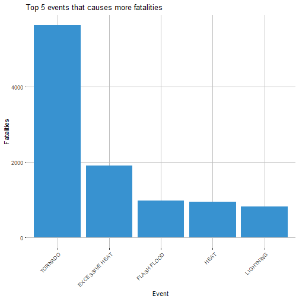
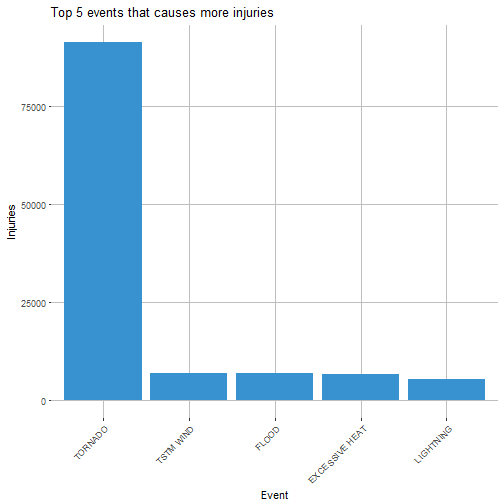
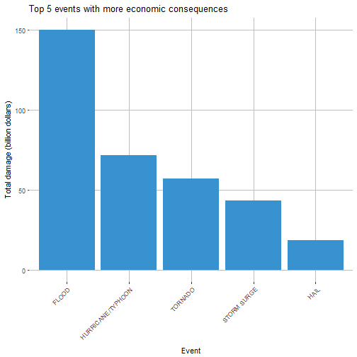

# Event most harmful with respect to population health and event with the greatest economic consequences
Leandro Carísio Fernandes


## Synopsis

Severe weather events can be harmful with respect to population health and can have economic consequences. In this report, we found out which events impact most considering these two aspects (health and economic).

Using the NOAA Storm Database, we checked the number of fatalites, injuries and the total damage caused by the events available in the database.

The event with more fatalities associated with is the TORNADO, followed by EXCESSIVE HEAT, FLASH FLOOD, HEAD, and LIGHTNING.

The event with more injuries associated with is the TORNADO, followed by TSTM WIND, FLOOD, EXCESSIVE HEAT, and LIGHTNING

The event with the greatest economic consequences is FLOOD, followed by HURRICANY/TYPHOON, TORNADO, STORM SURGE, and HAIL.

## Data Processing

First we download the data to the workspace directory and open it using `read.csv` function. The download is done only if the file does not exists. The `read.csv` function read the data in the zipped file. Since it can take some time, the following code is cached, so it is only readed once. So, from now on, we will not update the variable `original_data`.


```r
# Check if file exists in the working directory
local_file <- "StormData.csv.bz2"
fileURL <- "https://d396qusza40orc.cloudfront.net/repdata%2Fdata%2FStormData.csv.bz2"

if(!file.exists(local_file)){
    download.file(fileURL, local_file, method="curl")
}

original_data <- read.csv(bzfile(local_file), sep=",", header=T)
```

We can check the structure of `original_data`:


```r
str(original_data)
```

```
## 'data.frame':	902297 obs. of  37 variables:
##  $ STATE__   : num  1 1 1 1 1 1 1 1 1 1 ...
##  $ BGN_DATE  : Factor w/ 16335 levels "1/1/1966 0:00:00",..: 6523 6523 4242 11116 2224 2224 2260 383 3980 3980 ...
##  $ BGN_TIME  : Factor w/ 3608 levels "00:00:00 AM",..: 272 287 2705 1683 2584 3186 242 1683 3186 3186 ...
##  $ TIME_ZONE : Factor w/ 22 levels "ADT","AKS","AST",..: 7 7 7 7 7 7 7 7 7 7 ...
##  $ COUNTY    : num  97 3 57 89 43 77 9 123 125 57 ...
##  $ COUNTYNAME: Factor w/ 29601 levels "","5NM E OF MACKINAC BRIDGE TO PRESQUE ISLE LT MI",..: 13513 1873 4598 10592 4372 10094 1973 23873 24418 4598 ...
##  $ STATE     : Factor w/ 72 levels "AK","AL","AM",..: 2 2 2 2 2 2 2 2 2 2 ...
##  $ EVTYPE    : Factor w/ 985 levels "   HIGH SURF ADVISORY",..: 834 834 834 834 834 834 834 834 834 834 ...
##  $ BGN_RANGE : num  0 0 0 0 0 0 0 0 0 0 ...
##  $ BGN_AZI   : Factor w/ 35 levels "","  N"," NW",..: 1 1 1 1 1 1 1 1 1 1 ...
##  $ BGN_LOCATI: Factor w/ 54429 levels "","- 1 N Albion",..: 1 1 1 1 1 1 1 1 1 1 ...
##  $ END_DATE  : Factor w/ 6663 levels "","1/1/1993 0:00:00",..: 1 1 1 1 1 1 1 1 1 1 ...
##  $ END_TIME  : Factor w/ 3647 levels ""," 0900CST",..: 1 1 1 1 1 1 1 1 1 1 ...
##  $ COUNTY_END: num  0 0 0 0 0 0 0 0 0 0 ...
##  $ COUNTYENDN: logi  NA NA NA NA NA NA ...
##  $ END_RANGE : num  0 0 0 0 0 0 0 0 0 0 ...
##  $ END_AZI   : Factor w/ 24 levels "","E","ENE","ESE",..: 1 1 1 1 1 1 1 1 1 1 ...
##  $ END_LOCATI: Factor w/ 34506 levels "","- .5 NNW",..: 1 1 1 1 1 1 1 1 1 1 ...
##  $ LENGTH    : num  14 2 0.1 0 0 1.5 1.5 0 3.3 2.3 ...
##  $ WIDTH     : num  100 150 123 100 150 177 33 33 100 100 ...
##  $ F         : int  3 2 2 2 2 2 2 1 3 3 ...
##  $ MAG       : num  0 0 0 0 0 0 0 0 0 0 ...
##  $ FATALITIES: num  0 0 0 0 0 0 0 0 1 0 ...
##  $ INJURIES  : num  15 0 2 2 2 6 1 0 14 0 ...
##  $ PROPDMG   : num  25 2.5 25 2.5 2.5 2.5 2.5 2.5 25 25 ...
##  $ PROPDMGEXP: Factor w/ 19 levels "","-","?","+",..: 17 17 17 17 17 17 17 17 17 17 ...
##  $ CROPDMG   : num  0 0 0 0 0 0 0 0 0 0 ...
##  $ CROPDMGEXP: Factor w/ 9 levels "","?","0","2",..: 1 1 1 1 1 1 1 1 1 1 ...
##  $ WFO       : Factor w/ 542 levels ""," CI","$AC",..: 1 1 1 1 1 1 1 1 1 1 ...
##  $ STATEOFFIC: Factor w/ 250 levels "","ALABAMA, Central",..: 1 1 1 1 1 1 1 1 1 1 ...
##  $ ZONENAMES : Factor w/ 25112 levels "","                                                                                                               "| __truncated__,..: 1 1 1 1 1 1 1 1 1 1 ...
##  $ LATITUDE  : num  3040 3042 3340 3458 3412 ...
##  $ LONGITUDE : num  8812 8755 8742 8626 8642 ...
##  $ LATITUDE_E: num  3051 0 0 0 0 ...
##  $ LONGITUDE_: num  8806 0 0 0 0 ...
##  $ REMARKS   : Factor w/ 436781 levels "","-2 at Deer Park\n",..: 1 1 1 1 1 1 1 1 1 1 ...
##  $ REFNUM    : num  1 2 3 4 5 6 7 8 9 10 ...
```

As we can observe, there are some variables that will help us in this analysis:

1. EVTYPE - Type of the event
2. FATALITIES and INJURIES - Number of fatalities and injuries
3. PROPDMG and CROPDMG - Property and crop damage
4. PROPDMGEXP and CROPDMGEXP - Alphabetical characters used to signify magnitude ("H" for hundreds, "K" for thousands, "M" for millions, and "B" for billions)

Let's create a new table with only those variables. To make it easier to analyse the total damage, we will consider the total damage as the sum of property damage and crop damage. This operation can be cached:


```r
prop_dmg <- original_data[, "PROPDMG"] 
prop_dmg <- prop_dmg * ((original_data[, "PROPDMGEXP"] == "H") * 1e2) +
            prop_dmg * ((original_data[, "PROPDMGEXP"] == "K") * 1e3) +
            prop_dmg * ((original_data[, "PROPDMGEXP"] == "M") * 1e6) +
            prop_dmg * ((original_data[, "PROPDMGEXP"] == "B") * 1e9)

crop_dmg <- original_data[, "CROPDMG"]
crop_dmg <- crop_dmg * ((original_data[, "CROPDMGEXP"] == "H") * 1e2) +
            crop_dmg * ((original_data[, "CROPDMGEXP"] == "K") * 1e3) +
            crop_dmg * ((original_data[, "CROPDMGEXP"] == "M") * 1e6) +
            crop_dmg * ((original_data[, "CROPDMGEXP"] == "B") * 1e9)

# Get the total damage scalled to billion
total_dmg <- (prop_dmg + crop_dmg)/1e9

subset_original <- original_data[, c("EVTYPE", "FATALITIES", "INJURIES")]
subset_original <- cbind(subset_original, TOTALDMG = total_dmg)
```

Is there any **NA** in this subset?


```r
sum(is.na(subset_original))
```

```
## [1] 0
```

So, there are no **NA** in this subset.

Finally, we intend to know about the effects of these events in the economics and in the population health. So, we need to sum the fatalities, injuries and the total damage for all the events. This can be achieved using the `aggregate` function:


```r
result <- aggregate(cbind(FATALITIES, INJURIES, TOTALDMG)~EVTYPE,
                          data=subset_original, sum)
```

## Results

Now we can use the variable `result` to find the events that impacts more in the population health and with the greatest economic consequences. So, let's sort the variable `result` in the 


```r
print(paste(
    result[which.max(result$FATALITIES),"EVTYPE"],
    "is the event that causes more fatalities (",
    max(result$FATALITIES),
    ") fatalities"))
```

```
## [1] "TORNADO is the event that causes more fatalities ( 5633 ) fatalities"
```

```r
print(paste(
    result[which.max(result$INJURIES),"EVTYPE"],
    "is the event that causes more injuries (",
    max(result$INJURIES),
    ") injuries"))
```

```
## [1] "TORNADO is the event that causes more injuries ( 91346 ) injuries"
```

```r
print(paste(
    result[which.max(result$TOTALDMG),"EVTYPE"],
    "is the event with the greatest economic consequences (",
    max(result$TOTALDMG)/1e9,
    "billion dollars )"))
```

```
## [1] "FLOOD is the event with the greatest economic consequences ( 1.5031967825e-07 billion dollars )"
```

We can also check the top 5 most important events in these aspects (population health and economic consequences).

First, the top 5 events with more fatalities:


```r
library(ggplot2)

# Sort FATALITIES in decreasing order
result <- result[with(result, order(-FATALITIES)), ]

ggplot(result[1:5,], aes(x=reorder(EVTYPE, -FATALITIES), y=FATALITIES)) +
	labs(x="Event", y="Fatalities") +
	ggtitle("Top 5 events that causes more fatalities") +
	theme(panel.background = element_blank(), 
		panel.grid.major = element_line(colour="grey"),
		axis.text.x = element_text(angle = 45, hjust = 1)) +
	geom_bar(stat="identity", fill=rgb(56,146,208, maxColorValue = 255))
```



Second, let's see the top 5 events that cause more injuries:


```r
# Sort INJURIES in decreasing order
result <- result[with(result, order(-INJURIES)), ]

ggplot(result[1:5,], aes(x=reorder(EVTYPE, -INJURIES), y=INJURIES)) +
	labs(x="Event", y="Injuries") +
	ggtitle("Top 5 events that causes more injuries") +
	theme(panel.background = element_blank(), 
		panel.grid.major = element_line(colour="grey"),
		axis.text.x = element_text(angle = 45, hjust = 1)) +
	geom_bar(stat="identity", fill=rgb(56,146,208, maxColorValue = 255))
```



Finally, let's check the top 5 events with more economic consequences:


```r
# Sort TOTALDMG in decreasing order
result <- result[with(result, order(-TOTALDMG)), ]

ggplot(result[1:5,], aes(x=reorder(EVTYPE, -TOTALDMG), y=TOTALDMG)) +
	labs(x="Event", y="Total damage (billion dollars)") +
	ggtitle("Top 5 events with more economic consequences") +
	theme(panel.background = element_blank(), 
		panel.grid.major = element_line(colour="grey"),
		axis.text.x = element_text(angle = 45, hjust = 1)) +
	geom_bar(stat="identity", fill=rgb(56,146,208, maxColorValue = 255))
```


