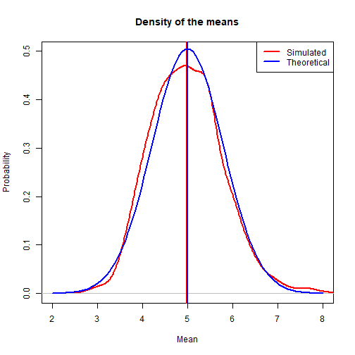
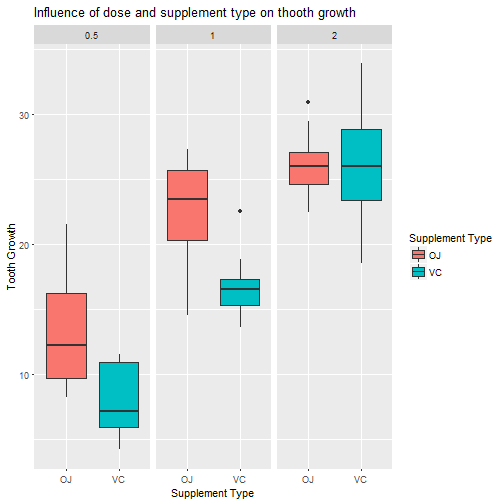

# Statistical Inference Course - Program Assignment
Leandro Carísio Fernandes


# Overview

This is the program assignment for the coursera "Statistical Inference Course". In this report we will analyse the exponential distribution and the effect of vitmin C and orange juice in different doses on tooth growth in Guinea pigs.

## Part 1 - Simulation Exercise

In this project we will investigate the exponential distribution in R and compare it with the Central Limit Theorem. The exponential distribution can be simulated in R with rexp(n, lambda) where lambda is the rate parameter. The mean of exponential distribution is 1/lambda and the standard deviation is also 1/lambda. We will consider lambda = 0.2 for all of the simulations. We should also consider a distribution of averages of 40 exponentials.

Now we should illustrate via simulation and associated explanatory text the properties of the distribution of the mean of 40 exponentials. Our tasks are:

### Task 1: Show the sample mean and compare it to the theoretical mean of the distribution.

First we set the seed to some number (I'm considering this year, 2017) and define the parameters of the simulation (lambda), the number of averages (n_avg) and the number of simulations (n_simulations) we will simulate.

Then, we will simulate the exponencial distribution with n_avg (40 samples) and store the mean in the variable mns. We will do this n_simulations (1000) times.

At the end, we just print the theortical mean of the distribution (i.e. 1/lambda, which in this case is 1/0.2 = 5.0) and the simulated mean (i.e. the mean of the vector mns). Here is the output:


```r
set.seed(2017)
lambda <- 0.2
n_avg <- 40
n_simulations <- 1000

mns <- NULL
for (i in 1 : n_simulations) mns = c(mns, mean(rexp(n_avg, lambda)))

sprintf("The theoretical mean of the distribution is %.2f", (1/lambda))
```

```
## [1] "The theoretical mean of the distribution is 5.00"
```

```r
sprintf(paste("The simulated mean of the distribution considering",
        "the distribution of the mean of 40 exponentials is %.2f"), mean(mns))
```

```
## [1] "The simulated mean of the distribution considering the distribution of the mean of 40 exponentials is 4.98"
```
Note: The figure in task 3 shows the theoretical and simulated mean.

### Task 2: Show how variable the sample is (via variance) and compare it to the theoretical variance of the distribution. 


So, the theoretical standard deviation of a population following a exponencial distribution is 1/lambda (5.0) and the theoretical variance is (1/lambda)^2 (25.0).

The simulated variance of a distribution of averages is equal to the variance of the population divided by n_avg (25/40 = 0.625). The code below prints the simulated variance and compares it to the theoretical one of the distribution of the means. They are approximatly equal to each other.


```r
sprintf(paste("The simulated variance should be equal to %.3f, i.e., 1/%.3f th",
              "of the theoretical variance of the population.",
              "Actually, the simulated variance is",
              "%.3f, which is very close to the theoretical value"), 
        (1/lambda)^2/n_avg,
        n_avg,
        var(mns))
```

```
## [1] "The simulated variance should be equal to 0.625, i.e., 1/40.000 th of the theoretical variance of the population. Actually, the simulated variance is 0.627, which is very close to the theoretical value"
```
Note: The figure in task 3 shows the theoretical and simulated variance of the data.

### Task 3: Show that the distribution is approximately normal.

To do this, we will plot the density of mns (i.e., the simulated data, in red) and the theoretical normal curve for this distribution (i.e., with mean equals 1/lambda and standard deviation equals 1/(lambda*sqrt(n_avg))).

The code also plot the theoretical mean and the simulated mean. Note they are almost the same (as shown in Task 1).


```r
plot(density(mns), xlab="Mean", ylab="Probability", 
     main="Density of the means", col="red", lwd=2,
     xlim=c(2,8), ylim=c(0,.5))
abline(v=mean(mns), col="red", lwd=2)

x <- seq(0, 10, by=0.1)
curve(dnorm(x, mean=1/lambda, sd=(1/lambda/sqrt(n_avg))), add=TRUE, col="blue", lwd=2)
abline(v=(1/lambda), col="blue", lwd=2)
legend("topright", c("Simulated", "Theoretical"), col=c("red", "blue"), lwd=2)
```



Since the two curves are approximately equal, simulated distribution is approximately normal.

## Part 2 - Basic Inferential Data Analysis

In the second portion of the project, we're going to analyze the ToothGrowth data in the R datasets package.

### Task 1: Load the ToothGrowth data and perform some basic exploratory data analyses

According to the help file of the ToothGrowth databse, it represents the effect of vitamin C on tooth growth in Guinea pigs.

Let's load the database, check if there are some NA's and how is its structure:

```r
data(ToothGrowth)
data <- ToothGrowth

sprintf("There are %d NA's in the database", sum(is.na(data)))
```

```
## [1] "There are 0 NA's in the database"
```

```r
str(data)
```

```
## 'data.frame':	60 obs. of  3 variables:
##  $ len : num  4.2 11.5 7.3 5.8 6.4 10 11.2 11.2 5.2 7 ...
##  $ supp: Factor w/ 2 levels "OJ","VC": 2 2 2 2 2 2 2 2 2 2 ...
##  $ dose: num  0.5 0.5 0.5 0.5 0.5 0.5 0.5 0.5 0.5 0.5 ...
```

```r
head(data)
```

```
##    len supp dose
## 1  4.2   VC  0.5
## 2 11.5   VC  0.5
## 3  7.3   VC  0.5
## 4  5.8   VC  0.5
## 5  6.4   VC  0.5
## 6 10.0   VC  0.5
```

So, we can see that the ToothGrowth database has 60 observations on 3 variables: len, representing the tooth length; supp, the supplement type (it can be OJ, orange juice, or VC, vitamin C); dose, the dose in mg/day (it can be 0.5, 1, or 2).

### Task 2: Provide a basic summary of the data.

We can check how many observations we have per supplement type and dose. And let's also check a basic summary of the data. Let's plot the influence of the dose and supplement type on the tooth growth.


```r
table(data$supp, data$dose)
```

```
##     
##      0.5  1  2
##   OJ  10 10 10
##   VC  10 10 10
```

```r
summary(data)
```

```
##       len        supp         dose      
##  Min.   : 4.20   OJ:30   Min.   :0.500  
##  1st Qu.:13.07   VC:30   1st Qu.:0.500  
##  Median :19.25           Median :1.000  
##  Mean   :18.81           Mean   :1.167  
##  3rd Qu.:25.27           3rd Qu.:2.000  
##  Max.   :33.90           Max.   :2.000
```

```r
library(ggplot2)
plot <- ggplot(data, aes(x=factor(supp), y=len, fill=factor(supp)))
plot + geom_boxplot(notch=F) + facet_grid(.~dose) +
    scale_x_discrete("Supplement Type") +   
    scale_y_continuous("Tooth Growth") +  
    scale_fill_discrete("Supplement Type") +
    ggtitle("Influence of dose and supplement type on thooth growth")
```



Using the plot above, it seems that the tooth grows with the dose and that a dose of 0.5 or 1.0 mg/day of orange juice is better than the same dose of vitamin C. For 2 mg/day, it seems that the orange juice and the vitamin C has the same effect. This is a visual inspection of the data and we need to check this out, which will be done in the next task.

### Task 3: Use confidence intervals and/or hypothesis tests to compare tooth growth by supp and dose.

To make it easier to get the confidence interval, let's create variables for the different supplement types and doses:


```r
oj05 <- data[with(data, supp == "OJ" & dose == 0.5), 1]
oj10 <- data[with(data, supp == "OJ" & dose == 1), 1]
oj20 <- data[with(data, supp == "OJ" & dose == 2), 1]
vc05 <- data[with(data, supp == "VC" & dose == 0.5), 1]
vc10 <- data[with(data, supp == "VC" & dose == 1), 1]
vc20 <- data[with(data, supp == "VC" & dose == 2), 1]
```

Now, we can get the confidence interval for each combination of dose/supplement type. Then, just put this variables in a dataframe and show a table with the results:


```r
# We can obtain the confidence interval using the formulae:
# interval = mean + c(-1,1)*qt(0.975, n-1)*sd/sqrt(n)
# or using the function t.test(data) and gettint the conf.int attribute
ci_oj05 <- t.test(oj05)$conf.int
ci_oj10 <- t.test(oj10)$conf.int
ci_oj20 <- t.test(oj20)$conf.int
ci_vc05 <- t.test(vc05)$conf.int
ci_vc10 <- t.test(vc10)$conf.int
ci_vc20 <- t.test(vc20)$conf.int

ci <- data.frame("Supplement"=c(rep("OJ",3), rep("VC", 3)),
                 "Dose"=rep(c(0.5,1,2), 2),
                 "Confidence interval (begin)"
                        =c(ci_oj05[[1]], ci_oj10[[1]], ci_oj20[[1]], 
                        ci_vc05[[1]], ci_vc10[[1]], ci_vc20[[1]]),
                 "Confidence interval (end)"
                        =c(ci_oj05[[2]], ci_oj10[[2]], ci_oj20[[2]], 
                        ci_vc05[[2]], ci_vc10[[2]], ci_vc20[[2]]))
kable(ci)
```


|Supplement | Dose| Confidence.interval..begin.| Confidence.interval..end.|
|:----------|----:|---------------------------:|-------------------------:|
|OJ         |  0.5|                   10.039717|                 16.420283|
|OJ         |  1.0|                   19.902273|                 25.497727|
|OJ         |  2.0|                   24.160686|                 27.959314|
|VC         |  0.5|                    6.015176|                  9.944824|
|VC         |  1.0|                   14.970657|                 18.569343|
|VC         |  2.0|                   22.707910|                 29.572090|

### Task 4: State your conclusions and the assumptions needed for your conclusions

Considering the confidence intervals above, we can conclude that:

1. For vitamin C, the higher the doses tested, the higher the tooth growth.
2. For orange juice, the tooth grows more with 1 mg/day than with 0.5 mg/day. Since there is a overlap in the confidence interval for 1 mg/day and 2 mg/day, we cannot say that the tooth grows more with 2 mg/day than with 1 mg/day.
3. For 0.5 and 1.0 mg/day, the tooth grows more with orange juice than with vitamin C. 
4. For 2.0 mg/day, it doesn't matter if the supplement type is orange juice or vitamin C.
